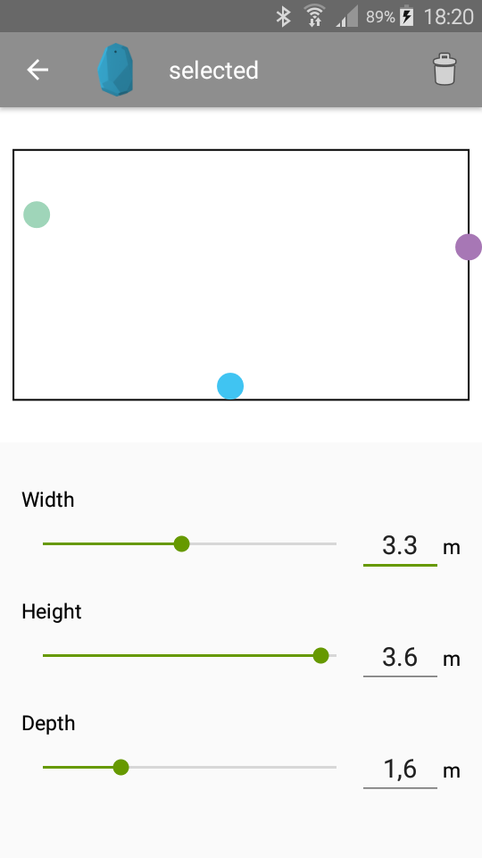
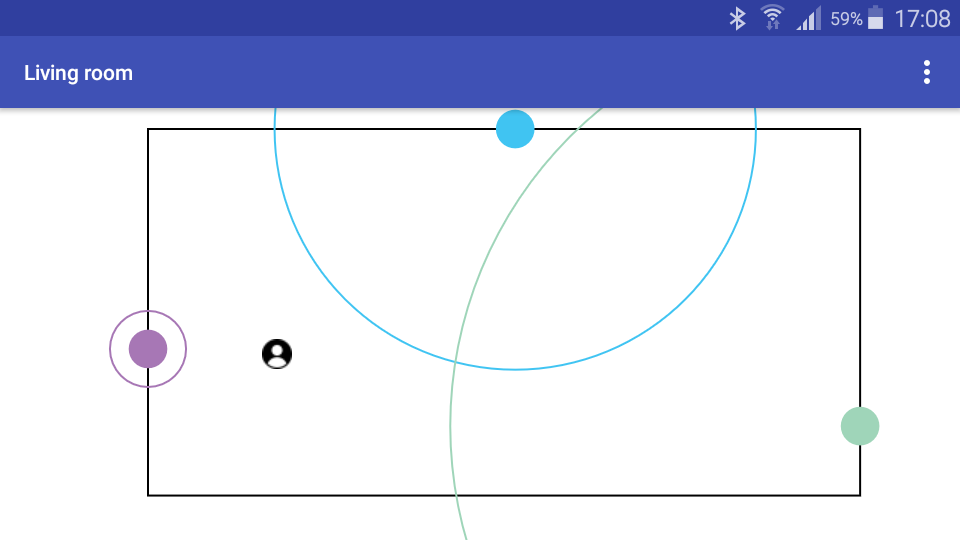

# EstimoteLocate
Indoor localization app for Estimote Beacons

  
  

This app allows definition of rooms and placing beacons within. After the rooms are defined, mobile devices can be localized using multilateration.
Also error correction in form of least squares is applied thanks to <a href="https://github.com/lemmingapex/trilateration">lemmingapex/trilateration</a>.
 This project is similar to the Estimote Indoor SDK which is only available for iOS.

The achieved accuarcy in a room of 7m * 3.8m is about 1.5m.

The aim of this app was researching possible AAL use cases using indoor localization.
Read the <a href="https://github.com/kburfi/EstimoteLocate/blob/master/Thesis_Burfeindt.pdf">thesis</a> for further information.

